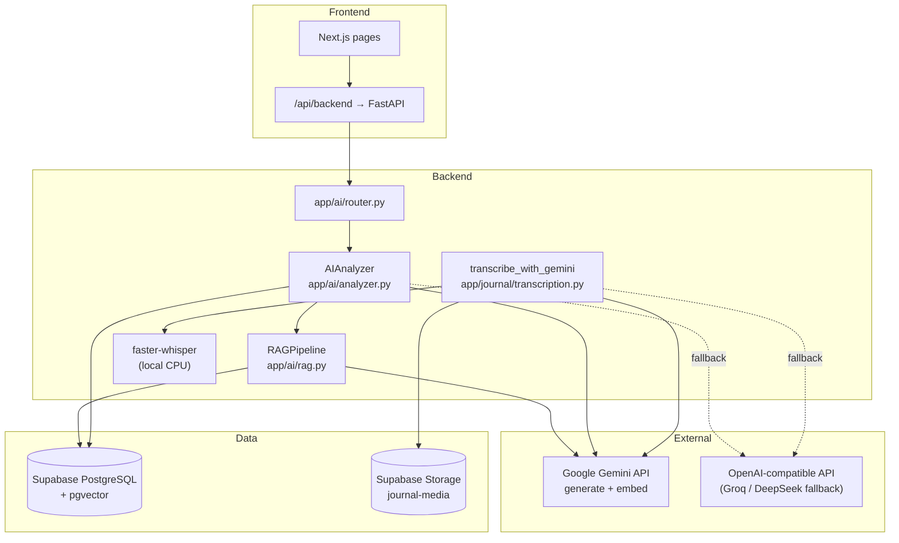
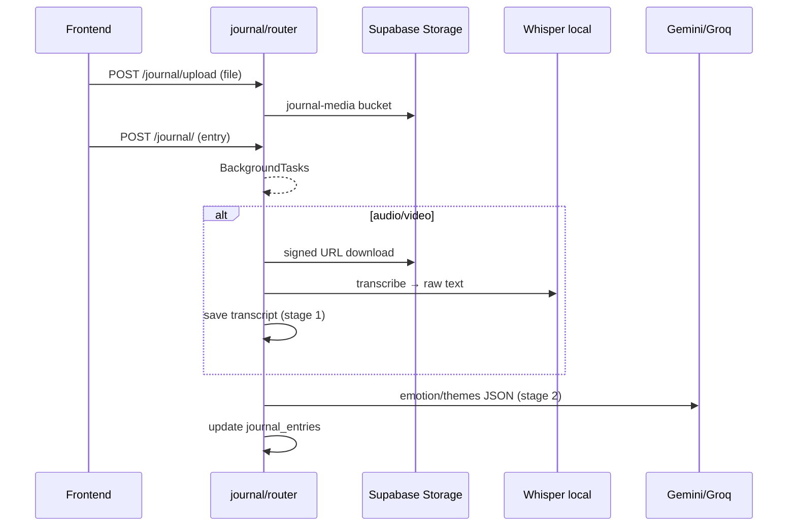

# HabitRefactor — AI Architecture

🇺🇦 [Українська версія](AI.uk.md)

This document describes how AI works in HabitRefactor: models, provider switching, RAG, each feature’s pipeline, and what is **not** LLM-based. Use it as a blueprint if you want to replicate the same design elsewhere.

---

## High-level overview



**Core idea:** one `AIAnalyzer` class talks to either **Gemini** or an **OpenAI-compatible** API. **Embeddings and RAG always use Gemini** (no Groq path for vectors). **Audio/video** uses **local Whisper** for speech-to-text, then Gemini/Groq only for structured emotion analysis.

---

## Models & providers

### Configuration (`backend/app/config.py`, `backend/.env`)

| Setting | Default | Role |
|---------|---------|------|
| `AI_PROVIDER` | `gemini` | Primary LLM backend: `gemini` or `openai_compat` |
| `GEMINI_API_KEY` | — | Required for Gemini + embeddings |
| `GEMINI_MODEL` | `gemini-flash-latest` | All JSON/text generation when provider is Gemini |
| `GEMINI_EMBEDDING_MODEL` | `gemini-embedding-001` | Vector embeddings (768 dims) |
| `GEMINI_EMBEDDING_DIMENSIONS` | `768` | Must match `vector(768)` in PostgreSQL |
| `OPENAI_API_KEY` | — | Used only when `AI_PROVIDER=openai_compat` **or** as fallback |
| `OPENAI_BASE_URL` | `https://api.groq.com/openai/v1` | Groq, DeepSeek, or any OpenAI-compatible host |
| `OPENAI_MODEL` | `llama-3.3-70b-versatile` | Fallback / alternate chat model |

### What uses which model

| Task | Primary | Fallback | Notes |
|------|---------|----------|-------|
| Daily / weekly analysis | `GEMINI_MODEL` | `OPENAI_MODEL` via Groq | JSON output |
| Oracle chat | `GEMINI_MODEL` | `OPENAI_MODEL` | JSON output |
| Hero chapter, manifesto, pain projection | `GEMINI_MODEL` | `OPENAI_MODEL` | JSON output |
| Catalyst letter | `GEMINI_MODEL` | `OPENAI_MODEL` | **Plain text** (not JSON) |
| Journal emotion/themes (stage 2) | `GEMINI_MODEL` | `OPENAI_MODEL` | JSON + schema (Gemini only) |
| Journal speech-to-text (stage 1) | **faster-whisper `base`** | — | Local CPU, not cloud |
| RAG embeddings | `GEMINI_EMBEDDING_MODEL` | — | **Always Gemini** |
| Knowledge-base batch embed | `GEMINI_EMBEDDING_MODEL` | — | Admin endpoint |
| Stats “Oracle” risk score | **No LLM** | — | Pure SQL/math on check-ins |
| Journal danger push | **Keyword list** | — | No LLM |
| Identity daily affirmation API | **Templates** | — | No LLM (prompt exists but unused) |

---

## Provider switch: how it works

### 1. Global switch (`AI_PROVIDER`)

In `AIAnalyzer.__init__`:

- `ai_provider == "gemini"` → `google.genai.Client`
- `ai_provider == "openai_compat"` → `AsyncOpenAI(base_url=OPENAI_BASE_URL)`

All `_generate()` calls route through this single branch.

### 2. Automatic Gemini → Groq failover (no env flip)

In `app/ai/router.py`:

```python
# Pseudologic
if primary fails and ai_provider == "gemini" and OPENAI_API_KEY is set:
    fallback_analyzer = AIAnalyzer(settings with ai_provider="openai_compat")
    retry action once
```

Functions:

- `_can_use_openai_fallback()` — checks non-empty `OPENAI_API_KEY`
- `_try_openai_fallback()` — clones settings with `ai_provider="openai_compat"` and new `AIAnalyzer`

Used for: daily/weekly analysis, hero chapter, catalyst letter/manifesto, Oracle chat.

**Retries before fallback:** `_run_with_retries()` — 2–3 attempts, 1–1.5s delay.

### 3. Hardcoded text fallbacks (no model)

If both Gemini and Groq fail, some endpoints return static copy (hero chapter, letter, manifesto, Oracle error message).

### 4. Journal transcription switch

`transcribe_with_gemini()` respects `AI_PROVIDER` only for **stage 2** (emotion JSON). Stage 1 is always Whisper for audio/video.

Gemini stage 2 has **exponential backoff** on 503/429 (`max_retries=3`).

### Important limitations

- **RAG never fails over to Groq** — if Gemini embedding quota is exhausted, search returns `[]` and prompts run with empty knowledge context.
- **No UI toggle** for models — only `.env` on the server.
- **`embed-knowledge-base`** is unauthenticated (dev); protect in production.

---

## RAG pipeline (`app/ai/rag.py`)

### Data sources

1. **`knowledge_base`** — curated books, videos, CBT, UA resources (~85 rows after seeds). Vectors in `embedding vector(768)`.
2. **`user_documents`** — user-specific chunks embedded after daily analysis (and potentially other sources).

### Flow (`build_context`)

```
user query text
    → generate_embedding (Gemini)
    → RPC search_knowledge_base(query_embedding, match_count, threshold=0.5)
    → RPC search_user_documents(p_user_id, query_embedding, match_count=10)
    → format knowledge_context + personal_context + knowledge_sources_list
```

### Search functions (PostgreSQL)

Defined in `database/migration.sql`:

- `search_knowledge_base` — cosine similarity via pgvector `<=>`, default threshold **0.7** in SQL, **0.5** in Python call
- `search_user_documents` — same, scoped by `user_id`

### Graceful degradation

Any embedding/search error → log + empty results. The LLM still runs; answers are less grounded.

### One-time setup

After `seed_knowledge_base.sql` + `011_ukrainian_knowledge_base.sql`:

```http
POST /api/v1/ai/embed-knowledge-base
```

Uses **service role** client; loops rows where `embedding IS NULL` (batch 500).

---

## Feature-by-feature

### 1. Daily analysis

| | |
|--|--|
| **Endpoint** | `POST /api/v1/ai/analyze/daily` |
| **Engine** | `AIAnalyzer.analyze_daily()` |
| **Prompt** | `DAILY_ANALYSIS_PROMPT` + `SYSTEM_PROMPT` |
| **Temperature** | 0.9 |
| **Output** | JSON → table `ai_analyses` (`analysis_type=daily_review`) |
| **RAG query** | Built from today’s check-in notes, relapse triggers, journal transcripts |
| **Side effects** | Embeds summary into `user_documents`; marks check-ins `ai_processed` |

### 2. Weekly analysis

| | |
|--|--|
| **Endpoint** | `POST /api/v1/ai/analyze/weekly` |
| **Prompt** | `WEEKLY_ANALYSIS_PROMPT` |
| **Input** | Last 7 days of daily `ai_analyses` + check-in aggregates |
| **Storage** | `ai_analyses` (`weekly_review`) |

### 3. Oracle chat (conversational coach)

| | |
|--|--|
| **Endpoints** | `POST /ai/oracle/chat`, `GET /ai/oracle/history`, `GET /ai/oracle/sessions` |
| **Prompt** | `ORACLE_CHAT_PROMPT` |
| **Temperature** | 0.7 |
| **Context** | RAG + last 7 days check-ins/journals + last 3 AI analyses + chat history (10 msgs, same `session_id`) |
| **Language** | `profiles.preferred_language` (`uk` / `en`) + rule: reply in user’s message language |
| **JSON fields** | `response`, `suggested_actions`, `resources[]`, `mood_detected`, `threat_level`, `suggest_professional_help` |
| **Storage** | `oracle_chats` (user + assistant rows, metadata on assistant) |

**Not the same as** `/stats/oracle` — that endpoint is statistical risk forecasting (see below).

### 4. Hero Mode chapter

| | |
|--|--|
| **Endpoint** | `POST /api/v1/ai/hero/generate` |
| **Prompt** | `HERO_CHAPTER_PROMPT` |
| **Data** | Last 7 days check-ins (victories/defeats) |
| **Storage** | `hero_chapters` |

### 5. Catalyst letter (future self)

| | |
|--|--|
| **Endpoint** | `POST /api/v1/ai/catalyst/letter` |
| **Tones** | `tough_love`, `compassionate`, `stoic`, `warrior` |
| **Output** | **Free text** (not JSON) — separate code path in `generate_catalyst_letter` |
| **RAG** | Yes |

### 6. Voice manifesto

| | |
|--|--|
| **Endpoint** | `POST /api/v1/ai/catalyst/manifesto` |
| **Prompt** | `MANIFESTO_PROMPT` |
| **JSON** | `manifesto`, `core_principles`, `daily_oath` |

### 7. Pain & pleasure projections

| | |
|--|--|
| **Endpoints** | `GET/POST /api/v1/ai/pain-projection/{habit_id}` |
| **Prompt** | `PAIN_PROJECTION_PROMPT` |
| **Temperature** | 0.5 (more factual) |
| **Input** | Habit cost/time/calories from DB |
| **Storage** | `pain_projections` (replaces old rows per habit) |

### 8. Multimodal journal (text / audio / video)



| Stage | Technology | Stored fields |
|-------|------------|---------------|
| Upload | FastAPI + service role | `media_url`, `journal-media/{user_id}/...` |
| Stage 1 | faster-whisper `base`, CPU int8 | `transcript`, `transcription_status` |
| Stage 2 | Gemini JSON schema or OpenAI `json_object` | `title`, `detected_emotions`, `key_themes`, `emotional_intensity`, … |

**Gemini-only:** `response_schema=GEMINI_RESPONSE_SCHEMA` for structured emotions.

**Re-transcribe:** `POST /journal/{id}/transcribe` triggers the same pipeline.

### 9. Insights UI

| | |
|--|--|
| **Endpoints** | `GET /ai/insights`, `GET /ai/insights/{id}`, `POST .../feedback`, `DELETE` |
| **Source** | Table `ai_analyses` (no new LLM call on read) |

### 10. Stats Oracle (not LLM)

| | |
|--|--|
| **Endpoint** | `GET /api/v1/stats/oracle` |
| **Code** | `app/stats/oracle.py` → `compute_oracle()` |
| **Logic** | Aggregates 365 check-ins + 14 journals: hourly/weekday relapse rates, danger score %, forecast |
| **Used by** | Dashboard charts, relapse interceptor worker (`ENABLE_RELAPSE_INTERCEPTOR`) |

### 11. Background “AI-adjacent” workers (`app/workers/scheduler.py`)

| Worker | Interval | AI? | Behavior |
|--------|----------|-----|----------|
| Pattern interceptor | 15 min (default) | No LLM | Rule-based patterns → push |
| Journal danger scanner | 5 min | **Keywords** | UA/EN danger words or `mood_rating <= 3` → push |
| Relapse interceptor | 30 min (opt-in) | No LLM | Uses `compute_oracle` danger score |
| Scheduled reminders | 1 min (opt-in) | No | Time-based push |

---

## Prompt system (`app/ai/prompts.py`)

| Constant | Used by |
|----------|---------|
| `SYSTEM_PROMPT` | All JSON generation via `_generate()` (Goggins/stoic/neuro coach persona) |
| `DAILY_ANALYSIS_PROMPT` | Daily analysis |
| `WEEKLY_ANALYSIS_PROMPT` | Weekly review |
| `ORACLE_CHAT_PROMPT` | Oracle chat |
| `HERO_CHAPTER_PROMPT` | Hero chapters |
| `CATALYST_LETTER_PROMPT` | Letters (plain text output) |
| `MANIFESTO_PROMPT` | Manifesto |
| `PAIN_PROJECTION_PROMPT` | Pain projections |
| `IDENTITY_AFFIRMATION_PROMPT` | **Defined but not wired** — affirmations are template-based in `identity/router.py` |

**JSON parsing:** `_parse_json_response()` strips markdown fences and extracts first complete `{...}` if Gemini appends extra text.

**Token limit:** `max_output_tokens=16384` on Gemini config.

---

## Frontend integration

All calls go through `frontend/src/lib/api.ts` → base URL `/api/backend` (Next.js proxy).

| Client helper | Backend route |
|---------------|---------------|
| `aiApi.analyzeDaily` | `POST /ai/analyze/daily` |
| `aiApi.analyzeWeekly` | `POST /ai/analyze/weekly` |
| `aiApi.oracleChat` | `POST /ai/oracle/chat` |
| `aiApi.generateHeroChapter` | `POST /ai/hero/generate` |
| `aiApi.generateLetter` | `POST /ai/catalyst/letter` |
| `aiApi.generateManifesto` | `POST /ai/catalyst/manifesto` |
| `aiApi.getPainProjection` | `GET /ai/pain-projection/{id}` |
| `journalApi.create` / `upload` | Triggers background transcription |

**Pages:** `/insights`, `/oracle`, `/forge`, `/journal`, `/pain`, `/identity` (no live LLM on affirm).

---

## Database tables (AI-related)

| Table | Purpose |
|-------|---------|
| `knowledge_base` | RAG corpus + `embedding` |
| `user_documents` | Per-user embedded chunks |
| `ai_analyses` | Daily/weekly AI reports |
| `oracle_chats` | Chat history + sessions |
| `journal_entries` | Transcripts, emotions, statuses |
| `hero_chapters` | Narrative chapters |
| `pain_projections` | Cost-of-inaction scenarios |
| `identity_statements` | Identity text (feeds prompts, not generated live) |

---

## Replication checklist

To build “the same” in another project:

1. **Single analyzer class** with `_generate()` branching on `AI_PROVIDER`.
2. **Separate embedding service** (always one provider) + pgvector RPC search.
3. **Failover:** primary Gemini + optional `openai_compat` clone of settings (not a user-facing switch).
4. **Journal:** local STT + small LLM pass for structure (cheaper than multimodal upload to Gemini).
5. **Oracle:** RAG + structured JSON with resources array + language rules in prompt.
6. **Post-seed job** to embed knowledge base rows.
7. **Distinguish** statistical risk engine from LLM chat (different names/routes avoid confusion).
8. **Background danger** can start with keywords before adding LLM classification.

---

## Key files

```
backend/app/config.py           # env settings
backend/app/ai/analyzer.py        # main LLM orchestration
backend/app/ai/router.py          # HTTP + retries + fallback
backend/app/ai/rag.py             # embeddings + search
backend/app/ai/prompts.py         # prompt templates
backend/app/journal/transcription.py  # Whisper + stage-2 LLM
backend/app/journal/router.py     # triggers background AI
backend/app/stats/oracle.py       # non-LLM risk math
backend/app/workers/scheduler.py  # pattern + journal keyword alerts
frontend/src/lib/api.ts           # API client
database/migration.sql            # pgvector + RPC functions
database/seed_knowledge_base.sql
database/011_ukrainian_knowledge_base.sql
```
