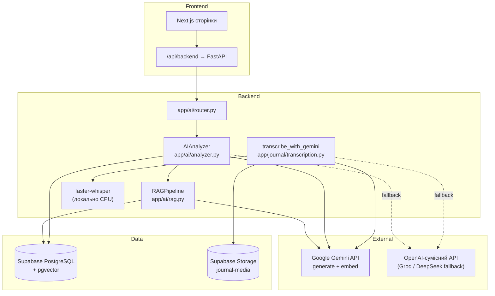
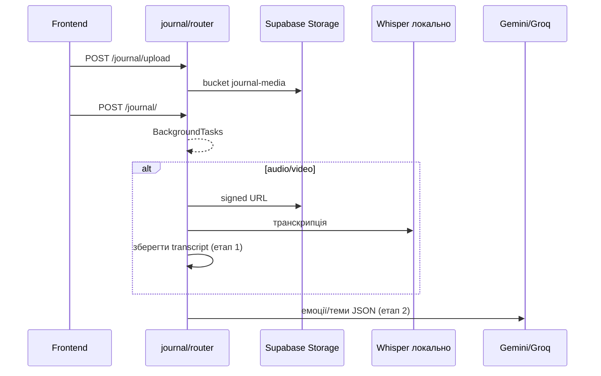

# HabitRefactor — Архітектура AI

🇬🇧 [English version](AI.md)

Цей документ описує, як працює AI у HabitRefactor: моделі, перемикання провайдерів, RAG, пайплайни фіч і що **не** є LLM. Використовуйте як шаблон, якщо треба зробити «так само» в іншому проєкті.

---

## Загальна схема



**Ідея:** один клас `AIAnalyzer` працює або з **Gemini**, або з **OpenAI-сумісним** API. **Embeddings і RAG завжди через Gemini** (немає Groq-шляху для векторів). **Аудіо/відео:** локальний **Whisper** для тексту, потім Gemini/Groq лише для структурованих емоцій.

---

## Моделі та провайдери

### Конфігурація (`backend/app/config.py`, `backend/.env`)

| Змінна | За замовчуванням | Роль |
|--------|------------------|------|
| `AI_PROVIDER` | `gemini` | Основний LLM: `gemini` або `openai_compat` |
| `GEMINI_API_KEY` | — | Обов’язковий для Gemini + embeddings |
| `GEMINI_MODEL` | `gemini-flash-latest` | Генерація тексту/JSON при `gemini` |
| `GEMINI_EMBEDDING_MODEL` | `gemini-embedding-001` | Вектори (768 вимірів) |
| `GEMINI_EMBEDDING_DIMENSIONS` | `768` | Має збігатися з `vector(768)` у PostgreSQL |
| `OPENAI_API_KEY` | — | При `openai_compat` або як fallback |
| `OPENAI_BASE_URL` | `https://api.groq.com/openai/v1` | Groq, DeepSeek тощо |
| `OPENAI_MODEL` | `llama-3.3-70b-versatile` | Fallback / альтернативний чат |

### Хто що використовує

| Задача | Основна модель | Fallback | Примітки |
|--------|----------------|----------|----------|
| Щоденний / тижневий аналіз | `GEMINI_MODEL` | `OPENAI_MODEL` (Groq) | JSON |
| Oracle chat | `GEMINI_MODEL` | `OPENAI_MODEL` | JSON |
| Hero chapter, manifesto, pain | `GEMINI_MODEL` | `OPENAI_MODEL` | JSON |
| Catalyst letter | `GEMINI_MODEL` | `OPENAI_MODEL` | **Звичайний текст**, не JSON |
| Емоції щоденника (етап 2) | `GEMINI_MODEL` | `OPENAI_MODEL` | JSON + schema (лише Gemini) |
| Транскрипція аудіо (етап 1) | **faster-whisper `base`** | — | Локально CPU |
| RAG embeddings | `GEMINI_EMBEDDING_MODEL` | — | **Завжди Gemini** |
| Batch embed knowledge base | `GEMINI_EMBEDDING_MODEL` | — | Admin endpoint |
| Stats «Oracle» (ризик) | **Без LLM** | — | SQL/математика |
| Push «небезпека» в щоденнику | **Ключові слова** | — | Без LLM |
| Identity affirmation API | **Шаблони** | — | Промпт є, але не підключений |

---

## Перемикання моделей / провайдерів

### 1. Глобальний перемикач (`AI_PROVIDER`)

У `AIAnalyzer.__init__`:

- `gemini` → `google.genai.Client`
- `openai_compat` → `AsyncOpenAI(base_url=OPENAI_BASE_URL)`

Усі виклики `_generate()` йдуть через цю гілку.

### 2. Автоматичний failover Gemini → Groq (без зміни .env)

У `app/ai/router.py`:

```python
# Псевдологіка
якщо primary впав і ai_provider == "gemini" і OPENAI_API_KEY заданий:
    fallback_analyzer = AIAnalyzer(settings з ai_provider="openai_compat")
    повторити дію один раз
```

- `_can_use_openai_fallback()` — перевірка `OPENAI_API_KEY`
- `_try_openai_fallback()` — копія settings з `openai_compat` + новий `AIAnalyzer`

Застосовується для: daily/weekly, hero, letter/manifesto, Oracle.

**Перед fallback:** `_run_with_retries()` — 2–3 спроби, пауза 1–1.5 с.

### 3. Жорсткі текстові fallback (без моделі)

Якщо впали і Gemini, і Groq — частина endpoint’ів повертає статичний текст (hero, лист, manifesto, Oracle).

### 4. Щоденник (journal)

`transcribe_with_gemini()` враховує `AI_PROVIDER` лише на **етапі 2** (JSON емоцій). Етап 1 — завжди Whisper.

На етапі 2 Gemini: **exponential backoff** при 503/429 (до 3 спроб).

### Обмеження

- **RAG не переходить на Groq** — при вичерпаній квоті embedding пошук повертає `[]`, LLM працює «всліпу».
- **Немає UI-перемикача** моделей — лише `.env` на сервері.
- **`embed-knowledge-base`** без авторизації (dev) — захистіть у production.

---

## RAG (`app/ai/rag.py`)

### Джерела

1. **`knowledge_base`** — книги, відео, КПТ, UA-ресурси (~85 записів після seeds), `embedding vector(768)`.
2. **`user_documents`** — персональні чанки (після daily analysis тощо).

### Потік (`build_context`)

```
текст запиту
    → generate_embedding (Gemini)
    → RPC search_knowledge_base(...)
    → RPC search_user_documents(...)
    → knowledge_context + personal_context + knowledge_sources_list
```

### Пошук у PostgreSQL (`database/migration.sql`)

- `search_knowledge_base` — косинусна відстань pgvector, у SQL threshold **0.7**, у Python виклик **0.5**
- `search_user_documents` — те саме, фільтр `user_id`

### Деградація

Помилка embedding/пошуку → лог + порожній список. LLM все одно відповідає, але без бази знань.

### Одноразове налаштування

Після seeds:

```http
POST /api/v1/ai/embed-knowledge-base
```

Service role; рядки з `embedding IS NULL`, пакетами по 500.

---

## Фічі по одній

### 1. Щоденний аналіз

| | |
|--|--|
| **Endpoint** | `POST /api/v1/ai/analyze/daily` |
| **Код** | `AIAnalyzer.analyze_daily()` |
| **Промпт** | `DAILY_ANALYSIS_PROMPT` + `SYSTEM_PROMPT` |
| **Temperature** | 0.9 |
| **Результат** | JSON → `ai_analyses` (`daily_review`) |
| **RAG** | Нотатки check-in, тригери, транскрипти щоденника за день |
| **Побічно** | Embedding у `user_documents`; `ai_processed` на check-in |

### 2. Тижневий огляд

| | |
|--|--|
| **Endpoint** | `POST /api/v1/ai/analyze/weekly` |
| **Промпт** | `WEEKLY_ANALYSIS_PROMPT` |
| **Вхід** | 7 днів daily insights + агрегати check-in |
| **Зберігання** | `ai_analyses` (`weekly_review`) |

### 3. Oracle chat (AI-коуч)

| | |
|--|--|
| **Endpoints** | `POST /ai/oracle/chat`, `GET /ai/oracle/history`, `GET /ai/oracle/sessions` |
| **Промпт** | `ORACLE_CHAT_PROMPT` |
| **Temperature** | 0.7 |
| **Контекст** | RAG + 7 днів check-in/journal + 3 останні AI-аналізи + історія чату (10 повідомлень, `session_id`) |
| **Мова** | `profiles.preferred_language` + правило: відповідь мовою повідомлення користувача |
| **JSON** | `response`, `suggested_actions`, `resources[]`, `mood_detected`, `threat_level`, `suggest_professional_help` |
| **БД** | `oracle_chats` |

**Це не те саме**, що `GET /stats/oracle` — там статистика ризику без LLM.

### 4. Hero Mode (розділ історії)

| | |
|--|--|
| **Endpoint** | `POST /api/v1/ai/hero/generate` |
| **Промпт** | `HERO_CHAPTER_PROMPT` |
| **Дані** | Check-in за 7 днів |
| **БД** | `hero_chapters` |

### 5. Catalyst letter (лист від «майбутнього я»)

| | |
|--|--|
| **Endpoint** | `POST /api/v1/ai/catalyst/letter` |
| **Тони** | `tough_love`, `compassionate`, `stoic`, `warrior` |
| **Вихід** | **Вільний текст** (окремий код, не `_generate`) |
| **RAG** | Так |

### 6. Voice manifesto

| | |
|--|--|
| **Endpoint** | `POST /api/v1/ai/catalyst/manifesto` |
| **Промпт** | `MANIFESTO_PROMPT` |
| **JSON** | `manifesto`, `core_principles`, `daily_oath` |

### 7. Pain projections (ціна звички)

| | |
|--|--|
| **Endpoints** | `GET/POST /api/v1/ai/pain-projection/{habit_id}` |
| **Промпт** | `PAIN_PROJECTION_PROMPT` |
| **Temperature** | 0.5 |
| **Вхід** | Вартість/час/калорії з `habits` |
| **БД** | `pain_projections` (старі рядки видаляються) |

### 8. Мультимодальний щоденник



| Етап | Технологія | Поля в БД |
|------|------------|-----------|
| Upload | service role | `media_url` |
| 1 | faster-whisper `base` | `transcript`, `transcription_status` |
| 2 | Gemini schema / OpenAI json | `detected_emotions`, `key_themes`, … |

**Повтор:** `POST /journal/{id}/transcribe`.

### 9. Insights (UI)

Читання з `ai_analyses` — **без нового виклику LLM**.

### 10. Stats Oracle (без LLM)

| | |
|--|--|
| **Endpoint** | `GET /api/v1/stats/oracle` |
| **Код** | `app/stats/oracle.py` |
| **Логіка** | 365 check-in + 14 journal: години/дні тижня, danger %, прогноз |
| **Workers** | Relapse interceptor (`ENABLE_RELAPSE_INTERCEPTOR`) |

### 11. Фонові workers (поруч з AI)

| Worker | Інтервал | LLM? | Що робить |
|--------|----------|------|------------|
| Pattern interceptor | 15 хв | Ні | Патерни → push |
| Journal danger | 5 хв | **Слова** | UA/EN ключові слова або mood ≤ 3 |
| Relapse interceptor | 30 хв (opt) | Ні | `compute_oracle` |
| Scheduled reminders | 1 хв (opt) | Ні | Push за часом |

---

## Промпти (`app/ai/prompts.py`)

| Константа | Де використовується |
|-----------|---------------------|
| `SYSTEM_PROMPT` | Усі JSON через `_generate()` (Goggins / стоїк / нейро-коуч) |
| `DAILY_ANALYSIS_PROMPT` | Щоденний аналіз |
| `WEEKLY_ANALYSIS_PROMPT` | Тижневий |
| `ORACLE_CHAT_PROMPT` | Oracle |
| `HERO_CHAPTER_PROMPT` | Hero |
| `CATALYST_LETTER_PROMPT` | Лист (текст) |
| `MANIFESTO_PROMPT` | Manifesto |
| `PAIN_PROJECTION_PROMPT` | Pain |
| `IDENTITY_AFFIRMATION_PROMPT` | **Не підключений** — affirmations у `identity/router.py` шаблонні |

**JSON:** `_parse_json_response()` прибирає ``` і витягує перший `{...}`.

**Ліміт:** `max_output_tokens=16384` (Gemini).

---

## Frontend

`frontend/src/lib/api.ts` → `/api/backend` (проксі Next.js).

| Helper | Backend |
|--------|---------|
| `aiApi.analyzeDaily` | `POST /ai/analyze/daily` |
| `aiApi.oracleChat` | `POST /ai/oracle/chat` |
| `journalApi.create` | фонова транскрипція |

**Сторінки:** `/insights`, `/oracle`, `/forge`, `/journal`, `/pain`.

---

## Таблиці БД (AI)

| Таблиця | Призначення |
|---------|-------------|
| `knowledge_base` | RAG + embedding |
| `user_documents` | Персональні вектори |
| `ai_analyses` | Daily/weekly звіти |
| `oracle_chats` | Чат + сесії |
| `journal_entries` | Транскрипти, емоції |
| `hero_chapters` | Розділи історії |
| `pain_projections` | Сценарії втрат |

---

## Чеклист «зробити так само»

1. Один `AIAnalyzer` + `_generate()` з гілкою `AI_PROVIDER`.
2. Окремий сервіс embedding (один провайдер) + pgvector RPC.
3. Failover: Gemini → клон settings з `openai_compat` (не UI-toggle).
4. Щоденник: локальний STT + малий LLM для JSON (дешевше за multimodal upload).
5. Oracle: RAG + JSON з `resources[]` + правила мови в промпті.
6. Job після seed для embed knowledge base.
7. Розділити **статистичний** oracle і **LLM-чат** (різні URL/назви).
8. Небезпеку в щоденнику можна почати з keywords, без LLM.

---

## Ключові файли

```
backend/app/config.py
backend/app/ai/analyzer.py
backend/app/ai/router.py
backend/app/ai/rag.py
backend/app/ai/prompts.py
backend/app/journal/transcription.py
backend/app/journal/router.py
backend/app/stats/oracle.py
backend/app/workers/scheduler.py
frontend/src/lib/api.ts
database/migration.sql
database/seed_knowledge_base.sql
database/011_ukrainian_knowledge_base.sql
```
